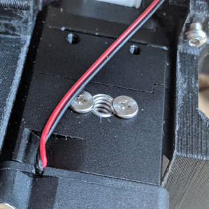
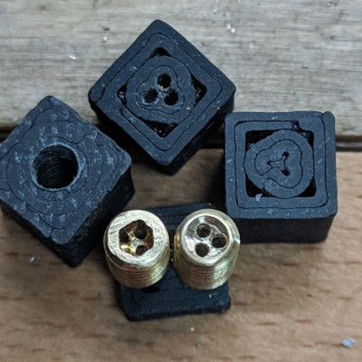
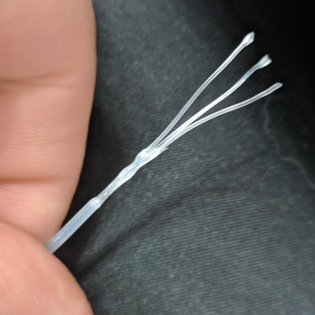
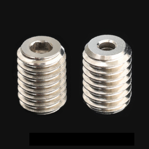
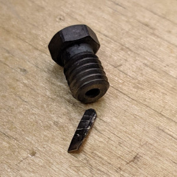
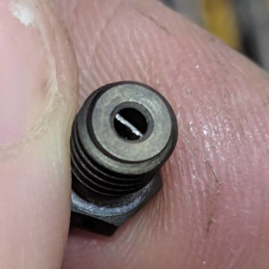
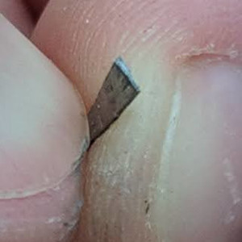
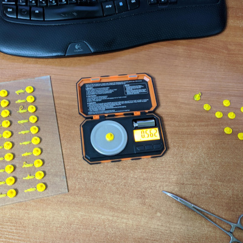
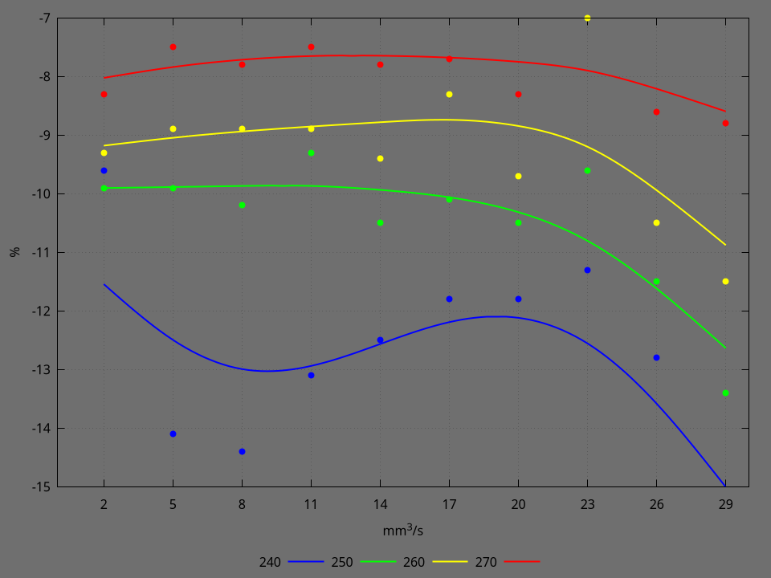
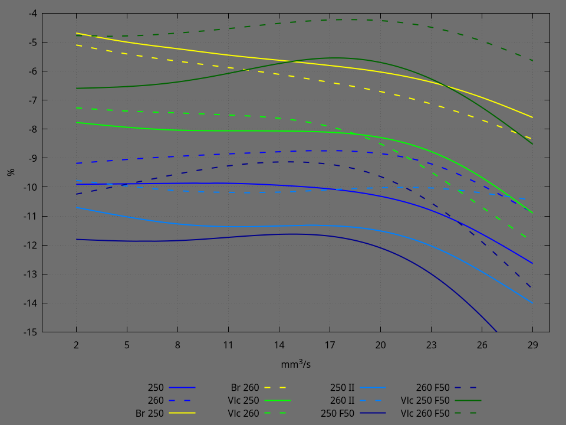

# Preambula
Stefan's experiments from _cnckitchen_ youtube channel inspired me to perform some extrusion tests and see what flow I can really get from volcano type hotend.

# Before the experiment
I always wanted to print faster, and most limiting factor in my opinion here is volumetric flow rate. So I always wanted to fit my printer with volcano style hotend. So happened I also wanted to try BIQU H2 head assembly and I changed head and hotend simultaneously. It was a huge printer upgrade including 220V heated bed and 24v power supply instead of 12V.

First problem I faced was insufficient cold end cooling. Turned out I forgot to switch board jumper for fans to 24V.

Second problem was insuficcient filament grip. It might have been caused by excessive heat but I doubt it. Anyway, I ended up with drilling a hole and replacing spring with larger one from BMG extruder.

I also tried (during debug of previous problems) to use high flow insert as Stefan designed, but after some prints concluded that it doesn't provide consistent underextrusion over various flow rates as it provides too much resistance to extrusion and might melt filament too early.

I decided to get rid of high flow insert but since I liked the idea of volcano adapter, I deciced to make one but with 1.8 mm drilling instead of 2.0 mm. My hope was it would provide better heat transfer and act as some sort of pre-heating.

I also thought about emulating CHT nozzle but without need of brazing. So I found thin enough metal and cut a small part that will fit 2 mm nozzle drilling. Metal from end switch levers works well. I also twisted it a bit just to give it more chance to heat the filament. It is yet to be determined if it is effective.

# Setup
1. Fystec BIG DIPPER (DUET 3 mini 5) board with TMC2209 drivers in spread cycle mode
2. PETG 1.75 mm yellow filament from fdplast.ru
3. Modified BIQU H2 extruder, 24V
   1. All metal bi-metal (copper + stainless) heat break
   2. Aluminum volcano heatblock
   3. 70W heater cartrige
   4. Semitec 104GT-2 kind thermistor
   5. Custom fitted stiffer spring
4. Different nozzles and inserts, all nozzles have 0.6 mm diameter
   1. Base variant is volcano adapter with 1.8 mm drilling and hardened steel nozzle with steel plate insert, no fan
   2. Br is volcano adapter with 1.8 mm drilling and brass nozzle
   3. Vlc is volcano brass nozzle 
   4. II is the same as base variant but with sherpened steel plate insert
   5. F50 indicates fan being enabled at 50%
5. I used Stefan's [FlowTestTool.xlsm](https://github.com/CNCKitchen/ExtrusionSystemBenchmark/blob/main/FlowTestTool.xlsm) to generate g-code.
6. 50 g / 0.001 g precision scales from aliexpress.
7. As 0% (100%) I took mass of 200 mm of filament extruded without hotend and heat break which turned out to be 0.626 g. With nozzle installed, the best result I've got was -4.2% flow (e.g. 4.2% underextrusion). It means weighted result was 4.2% less than expected or `0.626*(1-0.042) = 0.600` g.

# Results
First I tried different temperatures with base setup.

Below is the graph I ended with.

Dots represent actual data point whereas lines are result of smoothing with acsplines with 0.01 coefficient.

As you can see, stability of the result is low. Results can jump ±1%. One can speculate these outliers has to do something with stepper speed  or PID temperature regulations but in fact it requires further experimentation. Latter in the experiment I tried 1.99 initial value for flow instead of 2.0 but without any conclusive effect.

Starting from below, I would call 240°C temperature too low. However I'm not sure of what caused flow raising around 23 mm³/s. From 250°C temperature seems reasonable, at least I usually printed this PETG at this temperature. Remaining 3 temperatures show flat line up to 23 mm³/s and then drop down quite steeply.

During extrusion hotend temperature dropped up to 1.5°C below desired, but I didn't notice any variations of temperature drop depending on flow or temperature. Although watching temperature in real-time is not scientific.

I decided to continue experiment with two temperatures, 250 and 260°C. Below is the graph for various configurations.

Solid lines used for 250°C and dashed ones for 260°C.

Basic configuration data was taken from previous measurements. Although I duplicated the experiment with sharpened insert (brighter blue color, 250 II and 260 II). 1% lower flow was not exactly expected, so I'm inclined to say that's unaccounted environment variation, rather than statistically meaningful difference.

_Br_ configuration is with same adapter but brass nozzle. I'm inclined to say it show gradual (relative) flow drop with increase of extrusion speed. However, I have no idea why 260°C graph showed worse underextrusion than 250°C. Raw data is available below for your inspection.

_Vlc_ configuration is with common volcano brass nozzle. In that case 260°C graph is stated above 250°C but dropped below it after 17 mm³/s. Overall _vlc_ graphs showed almost 3% worse extrusion than 1.8 mm brass adapter with brass nozzle. Of course I woul like to say that 1.8 mm insert seems to do a good job pre-heating filament but I'm rather sceptic here. See the last experiment, volcano with fan enabled.

_II_ is second run with basic configuration but with sharpened insert. Didn't expect is to be worse than the first one. I would say, unaccounted environment change. I run the test along the course of two days.

_F50_ is basic configuration with model fan enabled at 50%. I immediately noticed that my model cooling is assymetrical as blobs were taller at one side. Otherwise it's kinda bit worse than with fan being off. But most interesting result follows.

_Vlc F50_ is volcano brass nozzle with fan at 50%. That was completely unexpected as it performed 2-3% better than one with fan being off.

# Conclusion

Repeatability of the experiment seems to be pretty low. Experiment should be repeated in more controlled matter, changing only one factor at a time. Series of experiments should be done, at least 3-4 executions for each one, probably shuffled. For instance, I could choose 3 or 4 configrations and perform them at one glass bed with pauses and nozzle changes in between rows. Next glass should be filled with same configurations but in different order. It probably would be better to avoid long pauses in between glasses as environment conditions might change. Filament should be in a dry box all the time.

Even the best result showed underextrusion of 4.2% compared to mass of the filament extruded without hotend. I have the only possible explanation -- slipping of the gears as I saw no filament chips or dust and heard no cracking / step skipping sound. Yet to be tested separetely with different nozzle diameters.

I generally expect inclination of the curve in the flat zone to be more important than absolute underextrusion value since it can be easily corrected by adjusting flow in the slicer. And I'm inclined to continue using nozzle with insert as it provides almost flat curve up to 20 mm³/s that allows easy correction of the flow for entire print. My prints could easily have 4 times variations of the flow, for instance from 18 mm³/s for large bulky parts, 9 mm³/s for first layer (where correct extrusion is important) and 4.5 mm³ for small details. However further experimentation is needed, possibly including more long-term tests than 200 mm of filament.

Extruder spring stiffnes seems to play very important role as before I was struggling with under extrusion. But with stiffer spring H2 extruder is able to handle high flows without significnant problems.

# Raw data

|Flow / Experiment|240   |250   |260   |270  |Brass 250|Brass 260|Volcano 250|Volcano 260|250 II|260 II|250 F50|260 F50|Vlc 250 F50|Vlc 260 F50|
|-----------------|------|------|------|-----|---------|---------|-----------|-----------|------|------|-------|-------|-----------|-----------|
|2                |-9.6% |-9.9% |-9.3% |-8.3%|-4.2%    |-4.8%    |-7.5%      |-7.0%      |-10.4%|-9.7% |-11.5% |-10.1% |-6.2%      |-4.2%      |
|5                |-14.1%|-9.9% |-8.9% |-7.5%|-6.1%    |-5.9%    |-8.1%      |-8.0%      |-11.0%|-9.6% |-12.0% |-10.5% |-6.7%      |-5.8%      |
|8                |-14.4%|-10.2%|-8.9% |-7.8%|-4.2%    |-5.6%    |-8.5%      |-7.0%      |-11.7%|-10.9%|-12.5% |-9.3%  |-7.0%      |-4.2%      |
|11               |-13.1%|-9.3% |-8.9% |-7.5%|-6.2%    |-5.9%    |-7.8%      |-8.3%      |-11.8%|-9.6% |-11.8% |-9.3%  |-6.4%      |-5.0%      |
|14               |-12.5%|-10.5%|-9.4% |-7.8%|-5.3%    |-5.8%    |-8.3%      |-7.3%      |-11.5%|-10.9%|-11.8% |-9.3%  |-5.9%      |-4.2%      |
|17               |-11.8%|-10.1%|-8.3% |-7.7%|-6.2%    |-6.9%    |-8.5%      |-8.0%      |-11.2%|-9.7% |-11.5% |-9.6%  |-4.8%      |-4.2%      |
|20               |-11.8%|-10.5%|-9.7% |-8.3%|-5.8%    |-6.4%    |-8.0%      |-7.5%      |-11.2%|-10.5%|-12.0% |-8.5%  |-5.6%      |-4.2%      |
|23               |-11.3%|-9.6% |-7.0% |-6.7%|-6.2%    |-7.0%    |-8.1%      |-8.6%      |-10.9%|-8.9% |-12.0% |-10.4% |-5.8%      |-4.2%      |
|26               |-12.8%|-11.5%|-10.5%|-8.6%|-6.2%    |-7.3%    |-8.5%      |-12.5%     |-13.1%|-10.5%|-13.3% |-11.2% |-6.5%      |-4.2%      |
|29               |-16.6%|-13.4%|-11.5%|-8.8%|-8.3%    |-8.8%    |-12.3%     |-11.5%     |-14.7%|-10.7%|-18.1% |-14.7% |-9.7%      |-6.5%      |

Complete data is available in [FlowTextTool.xlsm](./FlowTestTool.xlsm) although note that libreoffice somehow removed macro button from the document upon saving.

